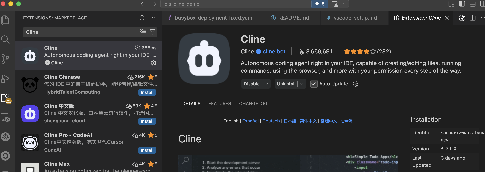
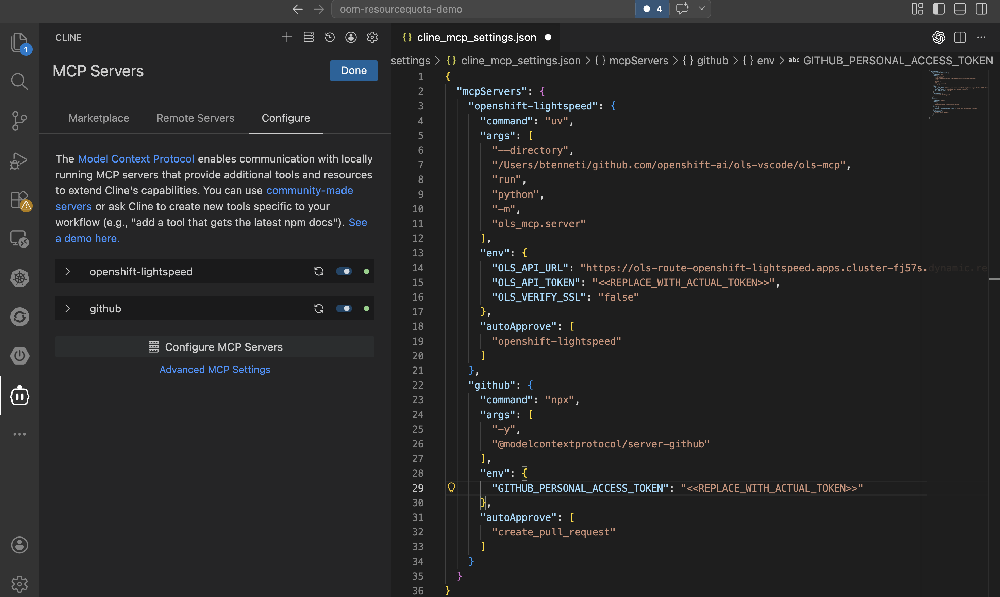

# VS Code Cline + MCP Setup Guide

This guide walks through setting up Cline AI Assistant with OpenShift LightSpeed and GitHub MCP servers in VS Code.

---

## 📸 Setup Screenshots

| Step | Screenshot |
|---|---|
| 1. Install Cline Extension |  |
| 2. Enable MCP Servers |  |
| 3. Verify Connection Status |  |
| 4. First Conversation |  |

---

## 🛠️ Step-by-Step Setup

### 1. Install Cline Extension
1. Open VS Code Extensions panel
2. Search for **Cline**
3. Click Install
4. Reload VS Code when prompted

### 2. Configure MCP Servers
Open Cline Settings:
- Press `Cmd/Ctrl + ,`
- Search for `Cline`
- Scroll to **Model Context Protocol Servers**

Add these server configurations:

```json
{
  "mcpServers": {
    "openshift-lightspeed": {
      "command": "uv",
      "args": [
        "--directory",
        "/path/to/ols-vscode/ols-mcp",
        "run",
        "python",
        "-m",
        "ols_mcp.server"
      ]
    },
    "github": {
      "command": "npx",
      "args": [
        "-y",
        "@modelcontextprotocol/server-github"
      ]
    }
  }
}
```

### 3. Authenticate GitHub
For GitHub MCP server:
1. Create Personal Access Token at https://github.com/settings/tokens
2. Grant `repo`, `workflow`, `pull_requests` permissions
3. Set environment variable:
   ```bash
   export GITHUB_TOKEN=your_token_here
   ```
4. Restart VS Code

### 4. Verify Setup
1. Open Cline panel
2. Check bottom status bar for MCP connection indicators
3. You should see ✓ next to both servers when connected

---

## ✅ Verification Checklist

- [ ] Cline extension installed and enabled
- [ ] MCP servers configured in settings
- [ ] GitHub token set with correct permissions
- [ ] Both servers show connected status
- [ ] Can query OpenShift best practices
- [ ] Can perform GitHub operations from chat

---

## 📝 Notes

- Screenshots should be placed in `/screenshots` directory
- All paths should be absolute or relative to your workspace
- Restart VS Code after making configuration changes
- Check Cline output panel for debugging information