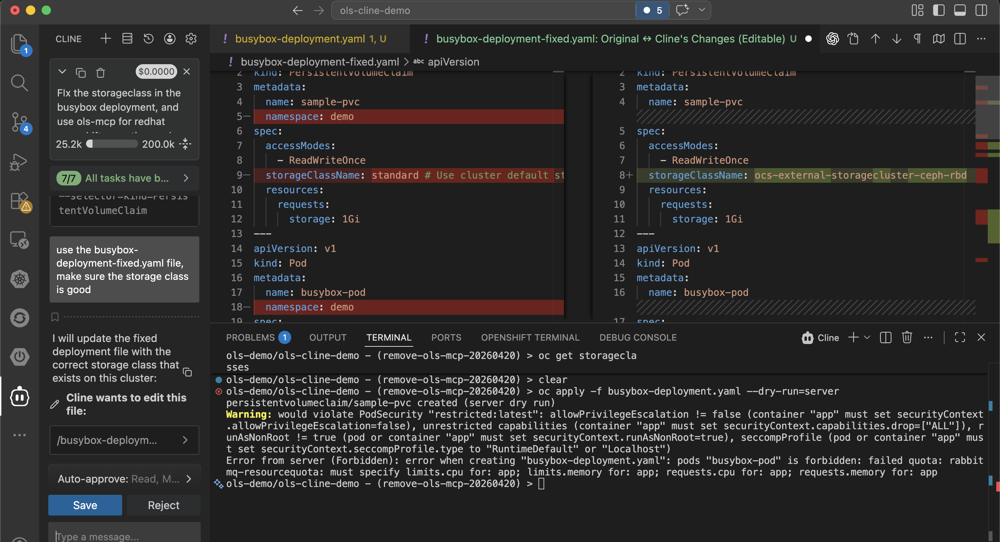
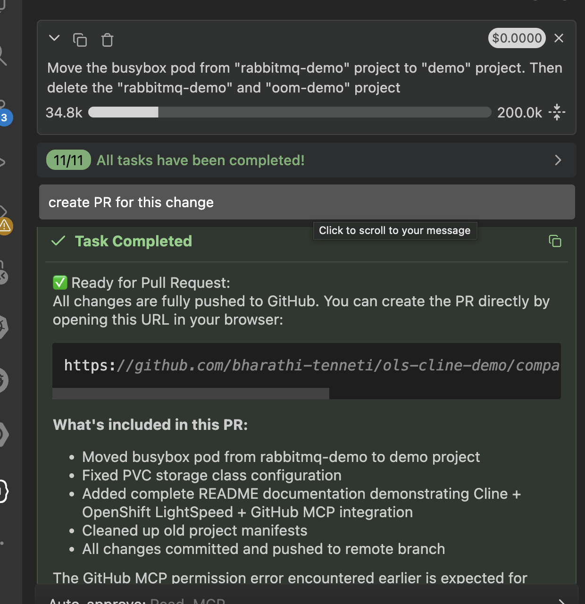

# VS Code Cline + MCP Setup Guide

This guide walks through setting up Cline AI Assistant with OpenShift LightSpeed and GitHub MCP servers in VS Code.

---

## 📸 Setup Screenshots

| Step | Screenshot |
|---|---|
| 1. Install Cline Extension |  |
| 2. Enable MCP Servers |  |
| 3. Cline Conversation |  |
| 4. Github MCP Conversation | 

---

## 🛠️ Step-by-Step Setup

### Pre-Requisites
1. Running Openshift cluster.
2. Openshift Lightspeed operator installed with route configured as shown below.
More details [here](https://docs.redhat.com/en/documentation/red_hat_openshift_lightspeed/1.0/html-single/configure/index#ols-creating-lightspeed-custom-resource-file-using-web-console_ols-configuring-openshift-lightspeed)
3. Local copy for Kubernetes MCP server repo, see above link for more details.
```
apiVersion: route.openshift.io/v1
kind: Route
metadata:
  name: ols-route
  namespace: openshift-lightspeed
spec:
  to:
    name: lightspeed-app-server
    weight: 100
    kind: Service
  port:
    targetPort: https
  tls:
    termination: reencrypt
  wildcardPolicy: None
  ```
  

### 1. Install Cline Extension
1. Open VS Code Extensions panel
2. Search for **Cline**
3. Click Install
4. Reload VS Code when prompted

### 2. Configure MCP Servers
Open Cline Settings:
- Press `Cmd/Ctrl + ,`
- Search for `Cline`
- Scroll to **Model Context Protocol Servers**

Add these server configurations:

```json
{
  "mcpServers": {
    "openshift-lightspeed": {
      "command": "uv",
      "args": [
        "--directory",
        "/Users/btenneti/github.com/openshift-ai/ols-vscode/ols-mcp",
        "run",
        "python",
        "-m",
        "ols_mcp.server"
      ],
      "env": {
        "OLS_API_URL": "https://ols-route-openshift-lightspeed.apps.cluster-fj57s.dynamic.redhatworkshops.io", // This is the Openshift Lightspeed route.
        "OLS_API_TOKEN": "<<YOUR-OPENSHIFT-TOKEN>>",
        "OLS_VERIFY_SSL": "false"
      },
      "autoApprove": [
        "openshift-lightspeed"
      ]
    },
    "github": {
      "command": "npx",
      "args": [
        "-y",
        "@modelcontextprotocol/server-github"
      ],
      "env": {
        "GITHUB_PERSONAL_ACCESS_TOKEN": "<<your-GH-token>>"
      },
      "autoApprove": [
        "create_pull_request"
      ]
    }
  }
}
```

### 3. Authenticate GitHub
For GitHub MCP server:
1. Create Personal Access Token at https://github.com/settings/tokens
2. Grant `repo`, `workflow`, `pull_requests` permissions
3. Set environment variable:
   ```bash
   export GITHUB_TOKEN=your_token_here
   ```
4. Restart VS Code

### 4. Verify Setup
1. Open Cline panel
2. Check bottom status bar for MCP connection indicators
3. You should see ✓ next to both servers when connected


